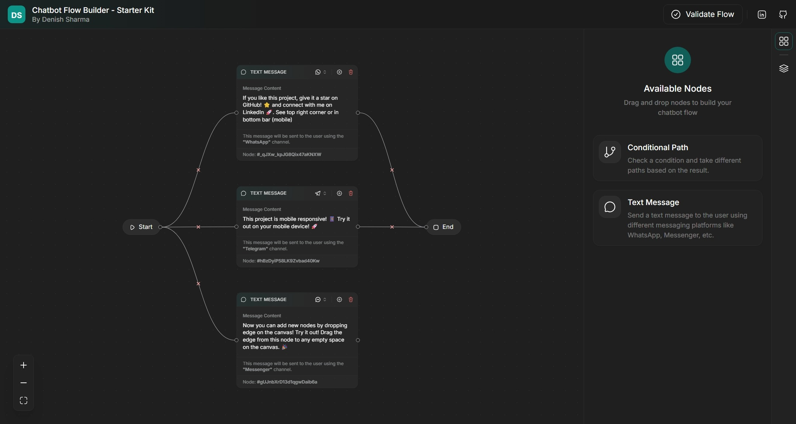

# Chatbot Flow Builder Starter Kit



A modern, extensible starter kit for building chatbot flow editors using React, React Flow, Zustand, and TypeScript.

## Table of Contents

- [Live Demo](#live-demo)
- [Features](#features)
  - [Nodes](#nodes)
  - [Sidebars](#sidebars)
  - [Flow](#flow)
- [Tech Stack](#tech-stack)
- [Getting Started](#getting-started)
- [Extending the Starter Kit](#extending-the-starter-kit)
  - [Add a New Node Type](#add-a-new-node-type)
  - [Add-or-Register-Property-Panels](#add-or-register-property-panels)
  - [Customize Flow Logic](#customize-flow-logic)
  - [Add Sidebar Panels or Features](#add-sidebar-panels-or-features)
  - [General Tips](#general-tips)
- [Contributing](#contributing)
- [Author](#author)

## Live Demo

[See the live demo](https://chatbot-flow-builder-task-bitespeed.vercel.app/)

## Features

### Nodes

- **Start Node**: Entry point of the flow.
- **Message Node**: Displays a message to the user.
- **Conditional Path Node**: Branches the flow based on conditions (showcases dynamic handles).
- **End Node**: Terminates the flow.

### Sidebars

- **Node Sidebar**: List of available nodes to add.
- **Node Properties Sidebar**: Edit properties of the selected node.

### Flow

- **Validation**: Ensures the flow has a start and end node.
- **Auto Adjust**: Automatically arranges nodes to avoid overlap (does not adjust edges).

## Tech Stack

- React
- React Flow
- Zustand
- TypeScript
- UnoCSS

## Getting Started

1. **Install dependencies:**
   ```sh
   pnpm install
   ```
2. **Start the development server:**
   ```sh
   pnpm dev
   ```
3. **Open** [http://localhost:5173](http://localhost:5173) in your browser.

## Extending the Starter Kit

This starter kit is designed to be easily extensible. Here are some common ways to extend the codebase:

### Add a New Node Type

Here's how you can add a new node, using the Start Node as a reference:

1. **Define the node type:**
   - Add a new entry in `src/modules/nodes/types.ts`:
     ```typescript
     export enum BuilderNode {
       START = 'start',
       // ...other nodes...
       CUSTOM = 'custom',
     }
     ```
2. **Create the node component and metadata:**
   - Create a new folder for your node in `src/modules/nodes/nodes/`, e.g. `custom-node/`.
   - Add your component as `custom.node.tsx` inside that folder. For example:
     ```tsx
     // src/modules/nodes/nodes/custom-node/custom.node.tsx
     import type { Node, NodeProps } from '@xyflow/react'
     import type { BaseNodeData, RegisterNodeMetadata } from '~/modules/nodes/types'
     import { Position } from '@xyflow/react'
     import { nanoid } from 'nanoid'
     import { memo, useMemo, useState } from 'react'
     import { cn } from '~@/utils/cn'
     import CustomHandle from '~/modules/flow-builder/components/handles/custom-handle'
     import { BuilderNode } from '~/modules/nodes/types'
     import { getNodeDetail } from '~/modules/nodes/utils'

     export interface CustomNodeData extends BaseNodeData {
       label?: string;
     }

     const NODE_TYPE = BuilderNode.CUSTOM

     type CustomNodeProps = NodeProps<Node<CustomNodeData, typeof NODE_TYPE>>

     export function CustomNode({ data, selected, isConnectable }: CustomNodeProps) {
       const meta = useMemo(() => getNodeDetail(NODE_TYPE), [])
       const [sourceHandleId] = useState<string>(nanoid())
       return (
         <>
           <div
             data-selected={selected}
             className="flex items-center border border-dark-100 rounded-full bg-dark-300 px-4 py-2 shadow-sm transition data-[selected=true]:(border-teal-600 ring-1 ring-teal-600/50)"
           >
             <div className={cn(meta.icon, 'size-4.5 shrink-0 mr-2 scale-130')} />
             <span className="mr-1">
               {data.label || meta.title}
             </span>
           </div>
           <CustomHandle
             type="source"
             id={sourceHandleId}
             position={Position.Right}
             isConnectable={isConnectable}
           />
         </>
       )
     }

     // eslint-disable-next-line react-refresh/only-export-components
     export const metadata: RegisterNodeMetadata<CustomNodeData> = {
       type: NODE_TYPE,
       node: memo(CustomNode),
       detail: {
         icon: 'i-custom:icon',
         title: 'Custom',
         description: 'A custom node example',
       },
       connection: {
         inputs: 0,
         outputs: 1,
       },
       available: true,
       defaultData: {
         label: 'Custom',
         deletable: true,
       },
     }
     ```

**Folder Structure Example:**

```
src/modules/nodes/nodes/
  start-node/
    start.node.tsx
  text-message-node/
    text-message.node.tsx
  conditional-path-node/
    conditional-path.node.tsx
```

### Add or Register Property Panels

To add a custom property panel for your node:

1. **Create the property panel component:**
   - Add a new component in `src/modules/sidebar/panels/node-properties/property-panels/`, e.g. `custom-node-property-panel.tsx`.
   - The component should accept `id`, `type`, `data`, and `updateData` props. See `text-message-property-panel.tsx` for a reference implementation.

2. **Link the property panel to your node:**
   - In your node's metadata (e.g., in `custom.node.tsx`), set the `propertyPanel` field to your panel component:
     ```tsx
     import CustomNodePropertyPanel from '~/modules/sidebar/panels/node-properties/property-panels/custom-node-property-panel'
     // ...
     export const metadata = {
       // ...existing metadata fields...
       propertyPanel: CustomNodePropertyPanel,
     }
     ```

3. **Registration is automatic:**
   - The codebase auto-registers property panels by mapping the `propertyPanel` field from each node's metadata into `NODE_PROPERTY_PANEL_COMPONENTS`.
   - When a node is selected, the sidebar will automatically render the correct property panel if it is linked in the node's metadata.

**Reference:**

- See `src/modules/sidebar/panels/node-properties/constants/property-panels.ts` for how property panels are mapped.
- See `src/modules/nodes/nodes/text-message-node/text-message.node.tsx` for an example of linking a property panel to a node.

### Customize Flow Logic

- Modify hooks in `src/modules/flow-builder/hooks/` to change validation, auto-adjust, or connection logic.
- Update UI components in `src/modules/flow-builder/components/` to change controls, menus, or edge behavior.

### Add Sidebar Panels or Features

- Add new panels in `src/modules/sidebar/panels/` and register them in the sidebar.

### General Tips

- The codebase is modular and uses TypeScript for type safety.
- Use the existing node and sidebar implementations as references for your extensions.

---

## Contributing

Contributions are welcome! Please open issues or submit pull requests for improvements and new features.

# Author

**Denish Sharma**
- Email: sahith12poreddy@gmail.com
- LinkedIn: [Sahith-Chandra](https://www.linkedin.com/in/sahith-chandra-poreddy-1b37b3242/)
- GitHub: [Sahith-Chandra](https://github.com/SahithPoreddy/)
